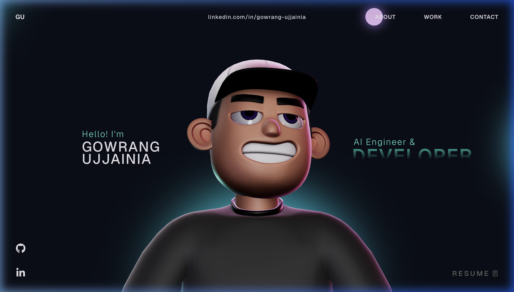
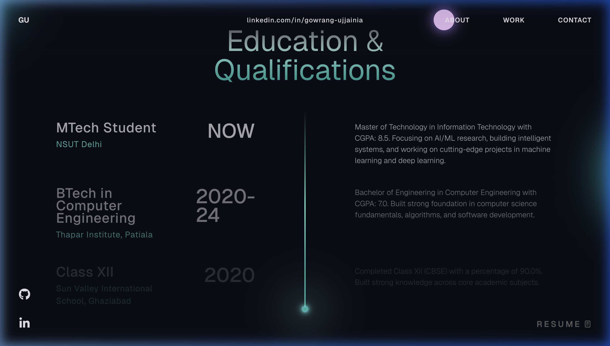
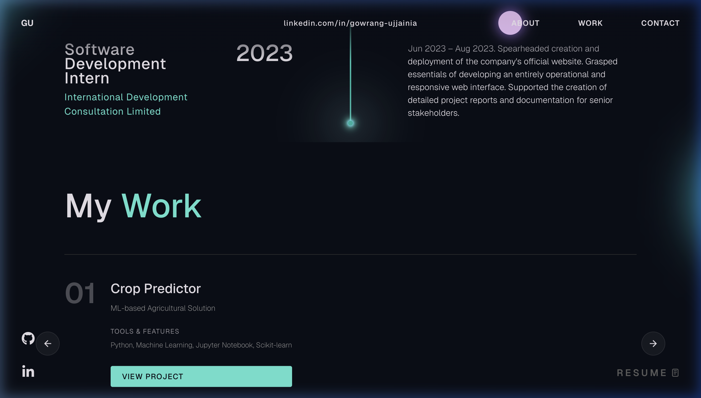
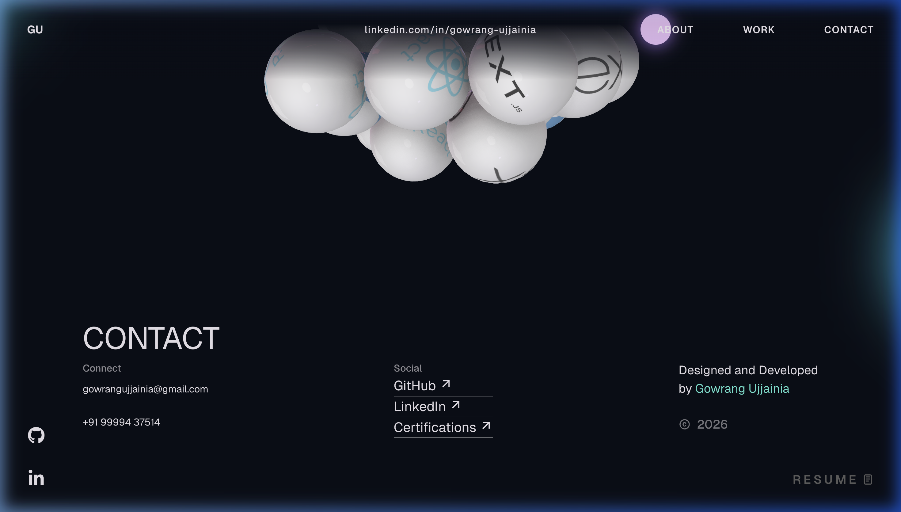

# Gowrang Ujjainia - 3D Portfolio

A modern, interactive 3D portfolio website showcasing my work as an AI Engineer and Developer. Built with React, TypeScript, Three.js, React Three Fiber, and GSAP, featuring animated sections, an interactive 3D character scene, custom cursor effects, and smooth scroll-driven transitions.

## Preview

### Hero


### Education & Qualifications


### My Work


### Contact


## Table of Contents

- [Features](#features)
- [Tech Stack](#tech-stack)
- [Project Structure](#project-structure)
- [Getting Started](#getting-started)
- [Available Scripts](#available-scripts)
- [GSAP License Note](#gsap-license-note)
- [Customization Guide](#customization-guide)
- [Troubleshooting](#troubleshooting)
- [Deployment](#deployment)
- [License](#license)

## About Me

I'm an MTech IT student at NSUT Delhi (CGPA: 8.5) specializing in AI/ML and software development. This portfolio showcases my projects in machine learning, deep learning, and full-stack development, including:

- **Crop Predictor** - ML-based agricultural solution
- **Heart Failure Predictor** - Healthcare AI application
- **Agentic AI Crew** - Multi-agent AI system
- **Music Player** - Android application
- **To-Do List** - Software application

## Features

- **Interactive 3D Experience** - Character scene with physics-based animations
- **Dynamic Tech Stack Display** - 3D floating spheres showcasing technologies
- **Smooth Animations** - GSAP-powered transitions and scroll effects
- **Custom Cursor** - Interactive cursor with hover states
- **Responsive Design** - Optimized for all screen sizes
- **Modern Architecture** - Clean, modular component structure

## Tech Stack

### Core

- React 18
- TypeScript
- Vite

### Animation and 3D

- GSAP + `@gsap/react`
- Three.js
- `@react-three/fiber`
- `@react-three/drei`
- `@react-three/postprocessing`
- `@react-three/cannon`
- `@react-three/rapier`

### Supporting Libraries

- `react-icons`
- `react-fast-marquee`
- `@vercel/analytics`

## Project Structure

```text
3d-portfolio-main/
├── public/
│   ├── images/                # Project images and tech stack icons
│   ├── models/                # 3D models and HDR environments
│   └── Gowrang_ujjainia_resume.pdf
├── src/
│   ├── components/
│   │   ├── Character/         # 3D scene and character animations
│   │   ├── styles/            # Component-specific styles
│   │   ├── About.tsx          # About section
│   │   ├── Career.tsx         # Experience timeline
│   │   ├── Contact.tsx        # Contact information
│   │   ├── Landing.tsx        # Hero section
│   │   ├── TechStack.tsx      # Interactive 3D tech stack
│   │   ├── WhatIDo.tsx        # Skills showcase
│   │   └── Work.tsx           # Projects carousel
│   ├── context/               # React context providers
│   ├── data/                  # Static configuration
│   └── App.tsx
├── package.json
└── vite.config.ts
```

## Getting Started

### Prerequisites

- Node.js 18+ (recommended)
- npm 9+ (or compatible)

### Installation

1. Clone the repository:

   ```bash
   git clone https://github.com/Gowrang/3d-portfolio.git
   cd 3d-portfolio-main
   ```

2. Install dependencies:

   ```bash
   npm install
   ```

3. Add required assets:
   - Place your resume PDF as `public/Gowrang_ujjainia_resume.pdf`

4. Start the development server:

   ```bash
   npm run dev
   ```

5. Open `http://localhost:5173` in your browser

## Available Scripts

- `npm run dev`  
  Starts Vite dev server and exposes host for local network testing.

- `npm run build`  
  Type-checks and builds a production-ready bundle.

- `npm run preview`  
  Serves the production build locally for verification.

- `npm run lint`  
  Runs ESLint checks across the project.

## GSAP License Note

This project uses the standard `gsap` package, including bonus plugins now available in the core package.

- Install dependencies with `npm install`.
- If migrating from older setups, remove `gsap-trial` from your project.

Read official installation guidance here: [GSAP Installation Docs](https://gsap.com/docs/v3/Installation/)

## Technologies Used

### Core
- **React 18** - UI framework
- **TypeScript** - Type safety
- **Vite** - Build tool and dev server

### 3D & Animation
- **Three.js** - 3D graphics
- **React Three Fiber** - React renderer for Three.js
- **React Three Drei** - Useful helpers for R3F
- **React Three Rapier** - Physics engine
- **GSAP** - Advanced animations

### Additional
- **React Icons** - Icon library
- **React Fast Marquee** - Smooth marquee effects

## Troubleshooting

- **Blank screen in development**  
  Check browser console for module import errors and verify all dependencies are installed.

- **3D performance issues on low-end devices**  
  Reduce scene complexity and post-processing effects in the character/scene utilities.

- **GSAP plugin errors**  
  Ensure you have the correct plugin package and license configuration for your target environment.

- **TypeScript build failures**  
  Run `npm run build` and address reported type errors before deploying.

## Building for Production

1. Create a production build:

   ```bash
   npm run build
   ```

2. Preview the production build locally:

   ```bash
   npm run preview
   ```

3. Deploy the `dist/` folder to your preferred hosting platform:
   - **Vercel** (recommended for React apps)
   - **Netlify**
   - **GitHub Pages**
   - **Cloudflare Pages**

## Connect With Me

- **LinkedIn**: [gowrang-ujjainia](https://www.linkedin.com/in/gowrang-ujjainia/)
- **GitHub**: [Gowrang](https://github.com/Gowrang)
- **Certifications**: [Google Drive](https://drive.google.com/drive/folders/1vnwwzrzofx2_0jFEEVFBZnRokYLws5ui?usp=drive_link)

## License

This project is open source and available under the [MIT License](LICENSE).

---

**Designed and Developed by Gowrang Ujjainia © 2026**
